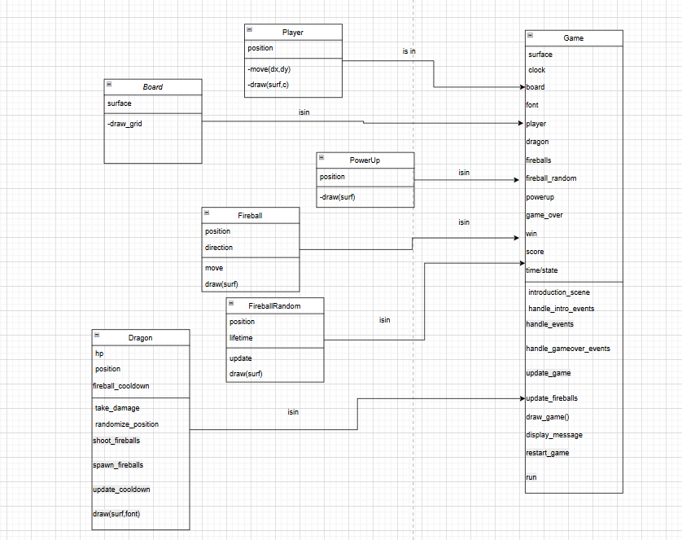
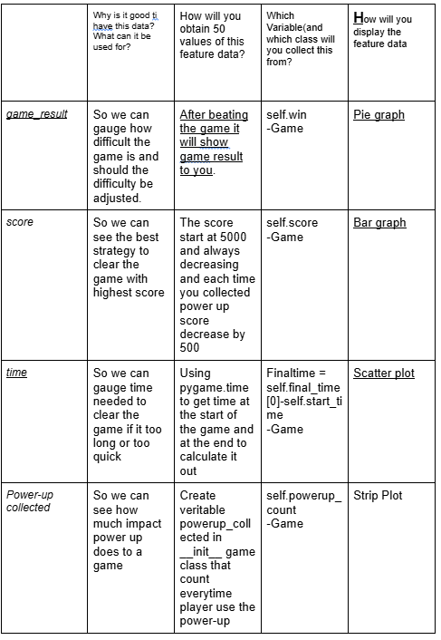

Slay the dragon

Project Overview
This game is table design with the main goal that you need to move the knight to relentlessly reach the dragon.

Project Review
This game are creating with the goal in mind of game that are challenging and fun.

Programming Development
3.1 Game Concept

The game are playing on the grid design of like 25*25 table. The dragon will be randomly placed on the grid(as a red box) the dragon has number on it to indicate how much hp its have left after the knight reach the dragon(move the knight with the arrow) the dragon hp(start at 10) decrease by 1 and then it randomly teleport to other place in the table.After dragon hp become lower than 8 it will start shoot fireball in straight line and after its hp become lower than 5 it will start generating fireball randomly on board continuously if player get hit by fireball it result in instant game over immediately.There are power up item randomly spawn as green box if knight reach it the knight will turn invincible for 5 second but each power up consume the total score will be reduced.After reach the dragon until the dragon hp become zero will result in game clear.

3.2  Object-Oriented Programming Implementation

Main class

Class Name
Purpose / Description
Board
Handles drawing the game grid onto the screen.
Player
Represents the knight the player controls. Handles movement and rendering itself on the board.
Dragon
Enemy entity. Tracks HP, can teleport, fire fireballs, and spawn random fireballs when its HP is low.
Fireball
A moving fireball shot by the dragon in straight lines. Manages its movement and rendering.
FireballRandom
Randomly appearing fireballs with a time-based lifetime. Checks for expiry and renders itself.
PowerUp
A collectible item that grants the player temporary invincibility. It manages its position and rendering.
Game
The main controller class. Initializes and runs the game loop, manages events, updates game state, draws all elements, handles game-over scenarios, tracks score, timers, and power-up logic.

3.3 Algorithms Involved

Technique / Algorithm Name
Where It’s Used
Type / Category
Event-driven Programming
Handling user input (keyboard events) and Pygame QUIT events
Software Architecture / Game Loop
Time-based Randomization
- Random dragon teleports at intervals - Random fireball spawn - Power-up spawn timing
Randomization / Procedural Generation
Linear Search / Iteration

Checking collisions between player and each fireball or power-up
Search / Collision Detection

Time-based State Management
Invincibility duration, fireball movement timing, dragon attack timing
State Machine / Time Management

Collision Detection (Equality Check)
Checking if positions match for collisions
Simple Geometric Collision Detection

Statistical Data (Prop Stats)

4.1 Data Features
1.Does player win the game?
2.Total score player recieve/
3.How long each game last
4.How many item player collected before game end.
5.How many move player made before clearing the game.
4.2 Data Recording Method
Explain how the game will store statistical data. Will it be saved in a database, CSV file, or another format?
All the needed data are showing in the game over or game win window status then the data will be manually added to the data.csv file.

4.3 Data Analysis Report
Outline how you will analyze the recorded data. What statistical measures will you use? How will the analysis be presented (e.g., graphs, tables, charts)?
In a table of data and scatter plot.

from the result it can be conclude that the power up item help win the game the most when player only use 2 power up.

5.project timeline

6. Document version
Version: 1.2
Date: 11 May 2025

